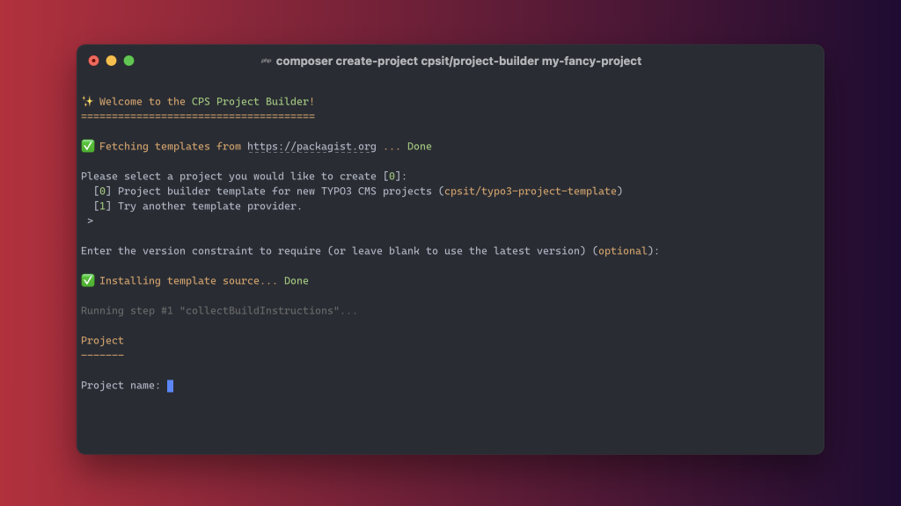

<div align="center">



# Project Builder

[](https://coveralls.io/github/CPS-IT/project-builder)
[](https://github.com/CPS-IT/project-builder/actions/workflows/cgl.yaml)
[](https://github.com/CPS-IT/project-builder/actions/workflows/docker.yaml)
[](https://github.com/CPS-IT/project-builder/actions/workflows/tests.yaml)
[](https://packagist.org/packages/cpsit/project-builder)

📙&nbsp;[Documentation](https://project-builder.cps-it.de/) |
📦&nbsp;[Packagist](https://packagist.org/packages/cpsit/project-builder) |
💾&nbsp;[Repository](https://github.com/CPS-IT/project-builder) |
🐛&nbsp;[Issue tracker](https://github.com/CPS-IT/project-builder/issues)

</div>

A Composer package used to **create new projects** based on various **project templates**.
All project templates are distributed as separate Composer packages. It comes with a
powerful configuration and templating system that allows to develop new project templates
in a very flexible way.

➡️ Read more in the [official documentation][1].

## ⚡ Quickstart

### Composer

[](https://packagist.org/packages/cpsit/project-builder)
[](https://packagist.org/packages/cpsit/project-builder)

```bash
composer create-project cpsit/project-builder <projectname>
```

### Docker

[](https://hub.docker.com/r/cpsit/project-builder)
[](https://github.com/CPS-IT/project-builder/pkgs/container/project-builder)
[](https://hub.docker.com/r/cpsit/project-builder)

```bash
docker run --rm -it -v <target-dir>:/app cpsit/project-builder
```

You can also use the image from [GitHub Container Registry][2]:

```bash
docker run --rm -it -v <target-dir>:/app ghcr.io/cps-it/project-builder
```

## 📙 Documentation

Please have a look at the [official documentation][1].

## 🧑‍💻 Contributing

Please have a look at [`CONTRIBUTING.md`](CONTRIBUTING.md).

## ⭐ License

This project is licensed under [GNU General Public License 3.0 (or later)](LICENSE).

[1]: https://project-builder.cps-it.de/
[2]: https://github.com/CPS-IT/project-builder/pkgs/container/project-builder
