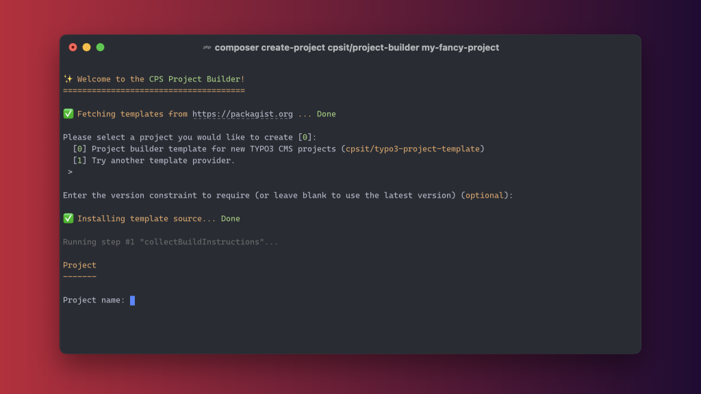

<div align="center">



# CPS Project Builder

[](https://codecov.io/gh/CPS-IT/Project-Builder)
[](https://codeclimate.com/github/CPS-IT/project-builder/maintainability)
[](https://github.com/CPS-IT/project-builder/actions/workflows/tests.yaml)
[](https://github.com/CPS-IT/project-builder/actions/workflows/cgl.yaml)
[](https://github.com/CPS-IT/project-builder/actions/workflows/docker.yaml)
[](https://packagist.org/packages/cpsit/project-builder)
[](https://packagist.org/packages/cpsit/project-builder)
[](https://hub.docker.com/r/cpsit/project-builder)
[](LICENSE)

📦&nbsp;[Packagist](https://packagist.org/packages/cpsit/project-builder) |
💾&nbsp;[Repository](https://github.com/CPS-IT/project-builder) |
🐛&nbsp;[Issue tracker](https://github.com/CPS-IT/project-builder/issues)

</div>

A Composer package used to create new projects based on various project templates.
All project templates are distributed as separate Composer packages. The Project Builder
comes with a powerful configuration and templating system that allows to develop new
project templates in a very flexible way.

By simply using the Composer command [`create-project`][1] it was never easier to create
new project repositories from command line.

## 🚀 Features

* Kickstarter package for new projects
* Easily extensible for new project templates
* Support for private templates via Composer registry or VCS repository
* Modern configuration and templating system

## ⚡ Usage

Usage with [Composer][2]:

```bash
composer create-project cpsit/project-builder <projectname>
```

Alternative usage with Docker:

```bash
docker run --rm -it -v <target-dir>:/app cpsit/project-builder
```

Please have a look at [`Usage`](docs/usage.md) for an extended overview.

## 📦 Available project templates

The following project templates are currently available:

| Composer package                    | Project type                    |
|-------------------------------------|---------------------------------|
| [`cpsit/typo3-project-template`][3] | Template for TYPO3 CMS projects |

Explore all publicly available project templates on [Packagist][4].

_If you want your project template to be listed here, feel free to submit a
[pull request][5]._

## 📖 Documentation

- [Architecture](docs/architecture.md)
- [Configuration](docs/configuration.md)
- [Dependency injection](docs/dependency-injection.md)
- [Events](docs/events.md)
- [Build steps](docs/build-steps.md)
- [Usage](docs/usage.md)

## 👩‍💻👨‍💻 Contributing

We welcome contributions! 💛 If you're considering to contribute to this project please do have a look
at [`CONTRIBUTING.md`](CONTRIBUTING.md) first.

## ⭐ License

This project is licensed under [GNU General Public License 3.0 (or later)](LICENSE).

[1]: https://getcomposer.org/doc/03-cli.md#create-project
[2]: https://getcomposer.org/
[3]: https://github.com/CPS-IT/typo3-project-template
[4]: https://packagist.org/?type=project-builder-template
[5]: https://github.com/CPS-IT/project-builder/pulls
