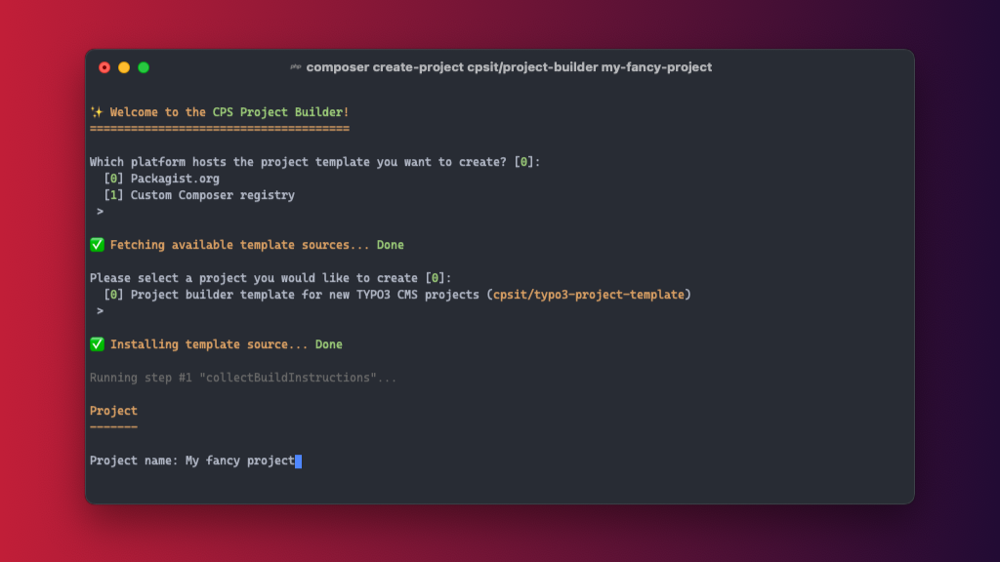

<div align="center">



# CPS Project Builder

[](https://github.com/CPS-IT/project-builder/actions/workflows/tests.yaml)
[](https://github.com/CPS-IT/project-builder/actions/workflows/cgl.yaml)
[](https://packagist.org/packages/cpsit/project-builder)
[](https://packagist.org/packages/cpsit/project-builder)
[](LICENSE)

:package:&nbsp;[Packagist](https://packagist.org/packages/cpsit/project-builder) |
:floppy_disk:&nbsp;[Repository](https://github.com/CPS-IT/project-builder) |
:bug:&nbsp;[Issue tracker](https://github.com/CPS-IT/project-builder/issues)

</div>

A template repository with templates for various project types develop at
[coding. powerful. systems. CPS GmbH][1]. The project comes with a powerful
configuration and templating system that allows to kickstart new project in
seconds. By using the Composer command [`create-project`][2], it was never
easier to create new project repositories from command line.

## :rocket: Features

* Kickstarter package for new projects
* Modern configuration and templating system
* Support for templating of external dependencies
* Easy extensible for new project types

## :zap: Usage

```bash
composer create-project cpsit/project-builder <projectname>
```

Please have a look at [`Usage`](docs/usage.md) for an extended overview.

## :open_file_folder: Configuration

Please have a look at [`Configuration`](docs/configuration.md).

## :roller_coaster: Architecture

Please have a look at [`Architecture`](docs/architecture.md) which explains
core concepts and lists all available components.

## :technologist: Contributing

Please have a look at [`CONTRIBUTING.md`](CONTRIBUTING.md).

## :star: License

This project is licensed under [GNU General Public License 3.0 (or later)](LICENSE).

[1]: https://www.cps-it.de
[2]: https://getcomposer.org/doc/03-cli.md#create-project
