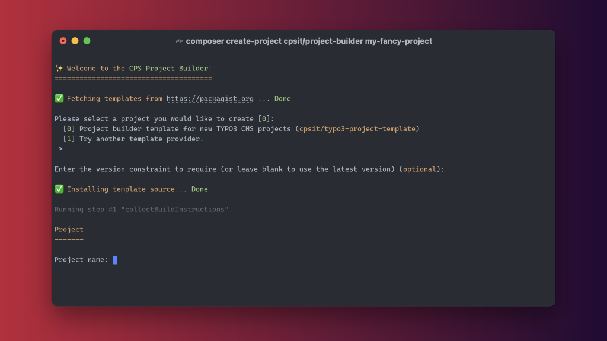

# Project Builder

[][1]
[][2]
[][3]
[](contributing/license.md)

A Composer package used to **create new projects** based on various **project templates**.
All project templates are distributed as separate Composer packages.

It comes with a powerful **configuration and templating system** that allows to develop
new project templates in a very flexible way.



## ⚡ Quickstart

```bash
composer create-project cpsit/project-builder <projectname>
```

Read more at [Getting started](getting-started.md).

## ⭐ License

This project is licensed under [GNU General Public License 3.0 (or later)](contributing/license.md).

```{toctree}
:hidden:

getting-started
```

```{toctree}
:hidden:
:caption: Usage

usage/composer
usage/docker
```

```{toctree}
:hidden:
:caption: Template development

development/architecture/index
development/configuration
development/build-steps
development/dependency-injection
```

```{toctree}
:hidden:
:caption: Contributing

contributing/workflow
contributing/license
```

[1]: https://packagist.org/packages/cpsit/project-builder
[2]: https://packagist.org/packages/cpsit/project-builder/stats
[3]: https://hub.docker.com/r/cpsit/project-builder
